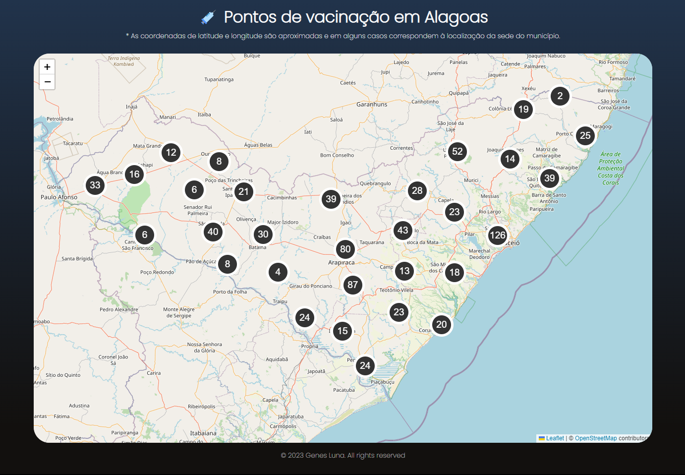

  

# Basic health units API and Website

Integration project developed for the systems architecture and application integration disciplines at Cesmac College.

The objective was to create an API and a website with information about the basic health units in the state of Alagoas, Brazil.

You can check the results here:
[website link](https://vacina-al.genesluna.dev/)

You can view the API docs here:
[swagger link](https://vacina-al.genesluna.dev/docs)

Website snapshot:

